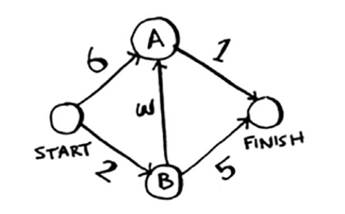
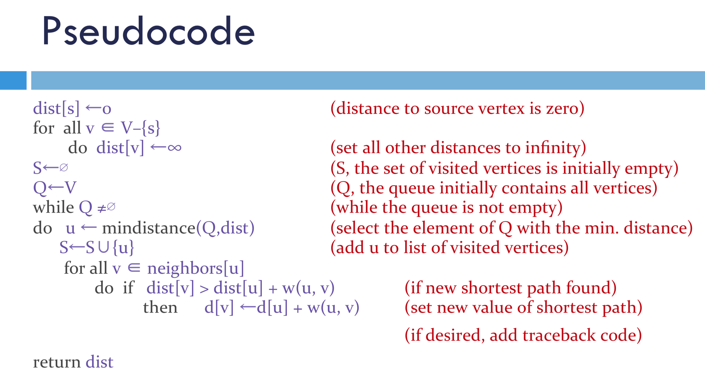
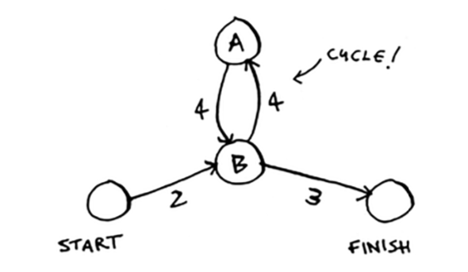
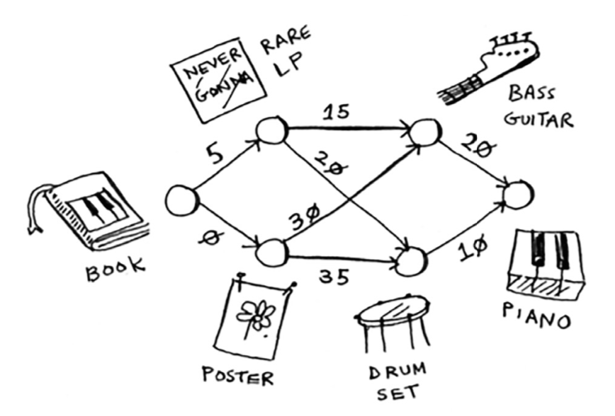

# 🔍 **DIJKSTRA Search**

> As similiar to Breadth-first search allows you to find the shortest distance between two things **BUT** in a **WEIGHTED** graph.

🏷 Classified as [Greedy Algotithm](../../greedy/README.md)

## **💡 Usage**

- Find the fastest route between two destinations on Map

## How the algorithm works

Given:



There are **Four** steps to Dijkstra's algorithm:

1. Find the `Cheapest` node. This is the node you can get to in the least amount of time.
2. Check whether there's a cheaper path to the neighbours of this node. If so, update their costs.
3. Repeat until you've done this for every node in the graph. (except for finish node)
4. Calculate the final path.



## Limitation

- Dijkstra's algorithm only works with `directed acyclic graphs` (_in mathematics, particularly graph theory, and computer science, a directed acyclic graph is a finite directed graph with no directed cycles_)



- All edges must have nonnegative weights (if having negative weight, use `Bellman-Ford Algorithm`)
- Graph must be connected

## Running Time

// TODO: add running time

## Implementation


the nodes are all items I can trade for. The weights on the edges are the amount of money he would have to pay to make the trade. Find the path from the book to the piano where I spend the least dough?

> you need an array to keep track of all the nodes you’ve already processed, because you don’t need to process a node more than once:
> `processed = []`

```javascript
// Need to do
```

## Usages

- find the tracing paths to get desired thing with the cheapest amount.

## **Points**

### **😕Open**

- [ ] What is the problem if we process a node twice?

### **✅ Solved**

- [x] In the Grokking book, it says `Dijkstra's does not work for graphs having negative-weight edges`. Because in this algorithm
  - once you process a node, it means there's no cheaper way to get they node (Not process one node twice).

## Source

- Grokking book
- [MIT presentation](https://math.mit.edu/~rothvoss/18.304.3PM/Presentations/1-Melissa.pdf)
