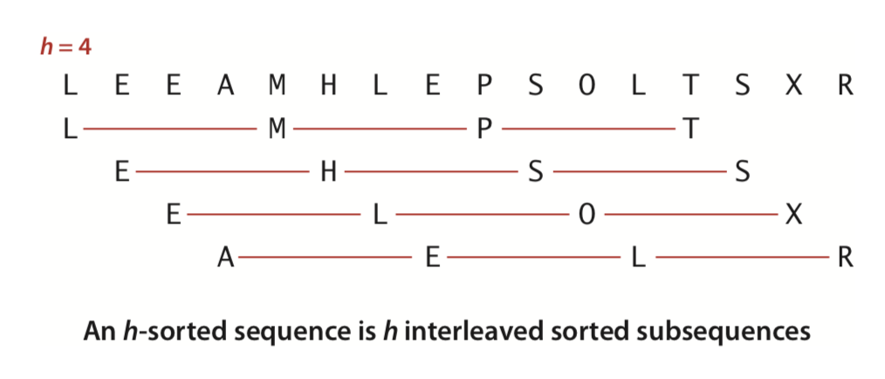

# Sellsort

It is an extension, fast algorithm based on Insertion sort. It gains speed (compared to Insertion sort) by allowing exchanges of array entries that are far apart.
It will produce **partially sorted arrays** that can be effeciently sorted, eventually by Insertion sort.

The idea is to rearrange items in which we take *h*th entries to reach next item from the current item.
Then we adjust *h* until its value is one.

In the book Algorithm, it suggests we start at the largest increment less than N/3 and decreasing to 1. 
After each loop, we decrese the *h* to 1/3**h*

## When To Use
- As it has acceptable running time even for moderately large arrays; it requires a small amount of code
  and use NO extra space. If you need a solution to a sorting problem, and are working in a situation where a system
  sort may not be available. You can safely use shellsort, then determine sometime later whether it will be worthwhile to replace it
  with a more sophicated method.
