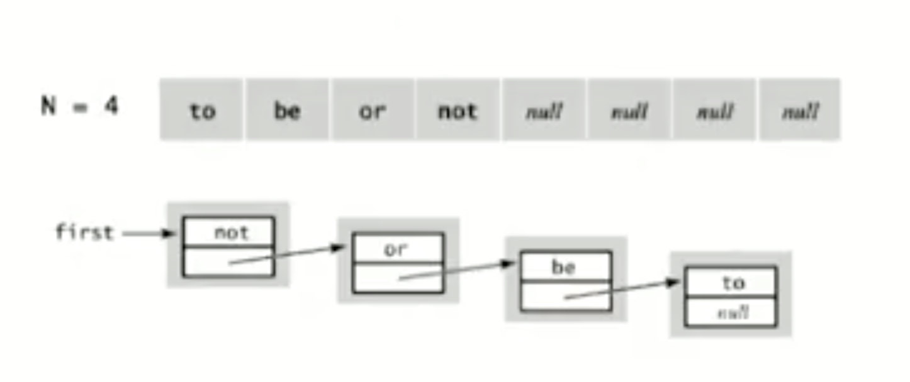

# STACK

A **Stack** is an abstract data type that serves as a collection of elements, it has two operations:

* **Push:** add an element to the collection
* **Pop:** take and remove the most recently added element.

## Applications

* Compilers/Run time environments, which use it to store recursive calls.
* Tree Traversals
* Reverse things
* Undo/Redo operations  
...

## Implementation

Stack is implemened using:

* Array / Dynamic Array
  * **Drawback**: have to resize when the number elements added goes beyond the size allocated. can be waste of memory spave as allocate more than needed. 
  * Not efficient for the huge number of elements
  * the Number of array accesses when pushing N elements = $`N + (2 + 4 + ... + N)`$ = $`N + 2^{logN} - 1`$ ~= $`N + N`$. But before we reach $`2^(LogN + 1)`$ we have to push k elements So the total number ~= $`3N`$

=> 2N + k ~ 3N

* [Singly Linked List](../linked-list/singly-linked-list.ts)
  * **Drawback**: occupy more memory, slower than the array based stack
  * Use extra times and space to deal with the links
  * Total amount of time will be higher than array-based stack

### Reference
https://stackoverflow.com/questions/7477181/array-based-vs-list-based-stacks-and-queues
