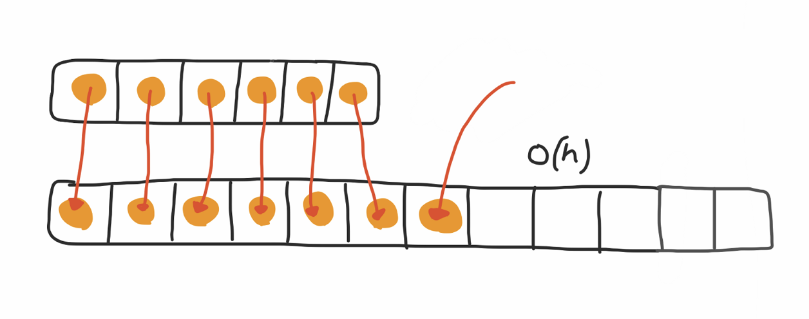

# Amortized Time



> express the time complexity `when an algorithm has the very bad time complexity only once in a while besides the time complexity that happens most of time`.

<https://medium.com/@satorusasozaki/amortized-time-in-the-time-complexity-of-an-algorithm-6dd9a5d38045>

For example, in the case of ArrayList, when it reaches the capacity and need to re-create itself with the doubled size, and then copy the items in the old ones to the new one, which takes `O(n)` where `n` is the capacity of the old array, and it is the worst case.

But the worst case happens once in a while everytime  the internal array hit its capacity. Therefore we could say the cost is *amortized*.

## How we could describe the two complexities

```
The intersection takes O(n) when the capacity has been reached, and the amortized time for each intersection is O(1)
```
