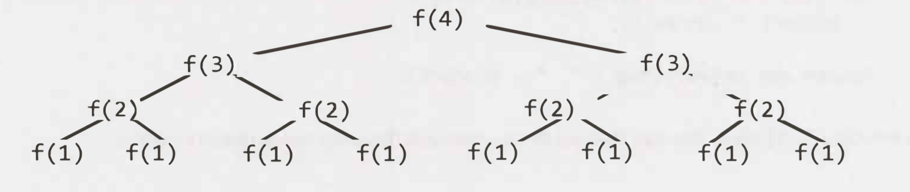

# Big O

## Recursive Runtimes

What is the runtime of this code?

```javascript
function f(n) {
  if (n <= 1) {
    return 1;
  }
  return f(n - 1) + f(n - 2);
}
```



The tree will have depth N. Each node has two children. Therefore each level will have twice as many calls as the one above it.

| Level | #Nodes |       Also expressed as...       |   Or... |
| ----- | ------ | :------------------------------: | ------: |
| 1     | 1      |                                  | $`2^0`$ |
| 2     | 2      |     2 \* previous level = 2      | $`2^1`$ |
| 3     | 4      | 2 _ previous level = 2 _ $`2^1`$ | $`2^2`$ |
| 4     | 8      | 2 _ previous level = 2 _ $`2^2`$ | $`2^3`$ |
| 5     | 16     | 2 _ previous level = 2 _ $`2^3`$ | $`2^4`$ |

Therefore, there will be $`2^0 + 2^1 + 2^2 + .... + 2^N = 2^{N+1} - 1`$ [demonstration](./math-formular.md#sum-of-powers-of-2)

> 🎯 when you have a recursive function that makes multiple calls, the runtime will often (but not always as in the case the number is 1 so O(n)) look like O($branches^{depth}$)
>
> 🎯 the base of a log does not matter for big O since logs of different bases are only different by a constant factor.

## Examples

- **`Suppose we had an algorithm that took in an array of strings, sorted each string, and then sorted the full array. What would the runtime be?`**

  - let `s` be the length of the longest string.
  - let `a` be the length of the array.
  - Soting each string is **`O(s log s)`**. We do this for every string, so that's **`O(a*s log s)`**.
  - Now we have to sort all the strings. This could be **`O(a log a)`**. But it is incorrect, because compare two strings takes **`O(s)`**. So the correct runtime is **`O(s*a log a)`**
  - Finally the total runtime is **`O(a*s(log s + log a)`**

- **`Suppose the following code prints all Fibonacci numbers from 0 to n. What is its time complexity?`**

```typescript
function allFib(n: number): void {
  for (let i; i < n; i++) {
    console.log(`i : ${fib(i)}`);
  }
}

function fib(n: number): number {
  if (n <= 0) return 0;
  else if (n == 1) return 1;
  return fib(n - 1) + fib(n - 2);
}
```

since `fib(b)` takes $`O(2^n)`$ time and it's called `n` times, then it's $`O(n * 2^n)`$ => **WRONG** 😭

let walk through each call

`fib(1)` -> $2^1$ steps <br />
`fib(2)` -> $2^2$ steps <br />
`fib(3)` -> $2^3$ steps <br />
...

=> Total is: $`2^1 + 2^2 + 2^3 + ... + 2^n = 2^{n+1} - 1`$ and the answer is $`O(2^n)`$
