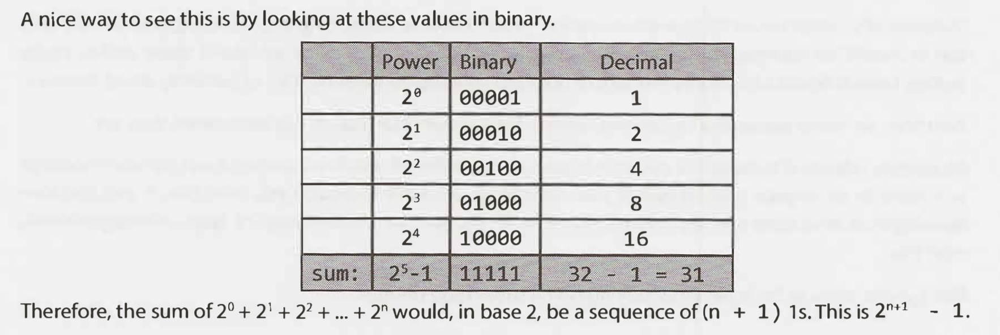

# Math formular

## Sum of integers 1 through N

What is 1 + 2 + .. + n ?

if n is even, we pair 1 with n, 2 with n - 1, and so on. We will have $n/2$ pairs each with sum `n + 1`.
if n is odd, we pair 0 with n, 1 with n - 1, and so on. We will have $(n+1)/2$ pairs each with sum `n`.

In either case, the sum is $n*(n+1)/2$

## Sum of Powers of 2

> 🎯 the sum of a sequence of powers of two is roughly equal to the *next* value in the sequence. $2^{n+1} - 1$

### Sum of Powers of a

$S_n$ =  1 + a + $a^2$ + ... + $a^n$

$S_n$ =  1 + $a*$(1 + a + $a^2$ ... + $a^{n-1}$ + $a^n$ - $a^n$)

$S_n$ =  1 + $a*$($S_n$ - $a^n$)

$S_n$ =  1 + $a*$$S_n$ - $a^{n+1}$

$S_n$$*(1-a)$ = 1 - $a^{n+1}$

$S_n$ = 1 - $a^{n+1}$ $/$ $(1-a)$

$S_n$ = ($a^{n+1}$ - 1) $/$ $(a-1)$
